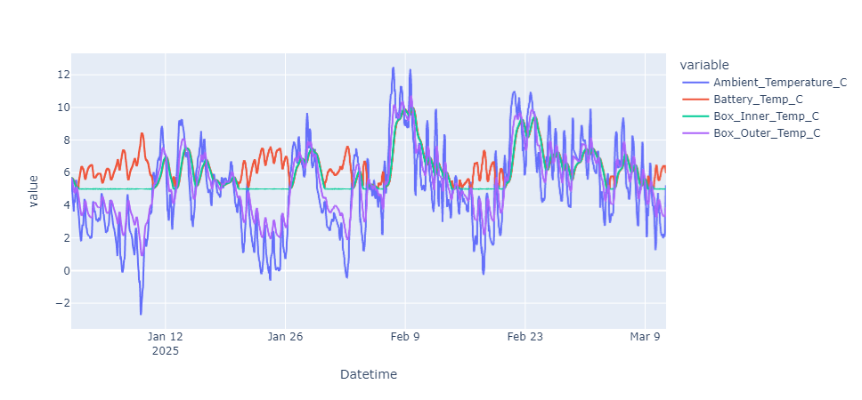

# Battery Thermal Model

## Table of Contents

- [Introduction](#introduction)
- [Features](#features)
- [Prerequisites](#prerequisites)
- [Installation Guide](#installation-guide)
  - [1. Install Python](#1-install-python)
  - [2. Install Git (Optional)](#2-install-git-optional)
  - [3. Clone or Download the Repository](#3-clone-or-download-the-repository)
  - [4. Set Up a Virtual Environment](#4-set-up-a-virtual-environment)
  - [5. Install Required Packages](#5-install-required-packages)
- [Additional Resources](#additional-resources)
- [Contact](#contact)

## Introduction

Welcome to the **Battery Thermal Model** repository! This codebase is designed to model the temperatures and net energy flows experienced by a Battery over the course of a year under varying conditions. 

The model retrieves TMY weather data for a specific location based on Latitude and Longitude. A Load Profile can then be generated to simulate the Battery under load, and the various losses that contribute to heat. Additionally a heater can also be modelled to model requirements for maintaining a minumum battery temperature. The net energy flows are recorded for the Battery, Inner/Outer walls, and to/from the environment. 

The Model is designed to be flexible and allow for different Battery & Box options to be modelled. By using arrays the model can simulate both conductive and convective heat flows, with the net energy flows and temperatures for each model parameter being recorded. Radiative energy flows have also been included in a recent update.

<div style="text-align: center;">
  
  <p>Graph of modelling showing heater activation when the box temperature reaches the trigger threshold</p>
</div>


## Features:
The current model has the following features:
  - Ability to generate full load profile to include typical annual domestic energy profile for UK household
  - Data is obtained using EU PVGIS satellite data for specific GPS coordinates provided
  - TMY and Load data extrapolation to desired model timespan increments
  - Full Conductive, Convective and Radiative heat energy flows modelled
  - Battery and Storage Box included in model
  - Material properties for Battery and Storage Box accurately captured
  - Ability to specify different configurations for the Battery within the Storage Box
  - Inclusion of Battery Heater to model energy requirements to maintain Battery temperature above threshold
  - Net energy flows recorded for all surface interactions, recorded in Joules for accurate accounting of Net Energy flows
  - Individual functions can be extracted, or full model can be run using Class based implementation.

When creating the model the interpolated time intervals modelled can be specified, with the following intervals currently being available:
- "1s" (1 second)
- "1m" (1 minute)
- "1h" (1 hour)

## Currently in devlopment:
- [X] Radiation losses to be added at all stages of the model. Function is made, just needs implemented
- [X] Ability to model customizable time intervals ranging from 1s - 1m over long periods of time. Current model is limited to only 1m intervals
- [X] Refactor Battery Thermal Model to work with numba acceleration
- [X] Add ability to add custom dynamic load in addition to constant static load
- [X] Class based implementation for easier model runtime configuration
- [ ] Streamlit app to allow for easier user input to change model parameters, as well as displaying results


## Example Implementation:

```python
from Battery.Battery_Model import Battery_Model, Load, TMY_Data, Battery, Container

latitude = 54.60283612642
longitude = -5.9324865926
interpolation_time_interval = "1m"

load = Load(
    daily_electric=9.91,
    profile="Domestic",
    country="UK",
    interpolation_time_interval=interpolation_time_interval
)

tmy_data = TMY_Data(
    latitude=latitude,
    longitude=longitude,
    interpolation_time_interval=interpolation_time_interval,
    load=load
)

battery = Battery(
    battery_length=0.9,
    battery_width=0.6,
    battery_height=0.3,
    battery_heat_capacity=1000.0,
    battery_mass_kg=36.0,
    battery_losses_perc=0.03,
    battery_emissivity=0.9,
    battery_transfer_array=[0, 1, 1, 1, 1, 1],
    heater_threshold_temp_c=5.0,
    heater_power_w=30.0,
    heater_time_minutes=5.0,
    heater_battery_transfer=0.8
)

box = Container(
    box_length=1.0,
    box_width=0.7,
    box_height=0.4,
    inner_material="Polystyrene",
    outer_material="Wood",
    inner_material_thickness_m=0.01,
    outer_material_thickness_m=0.01,
    box_transfer_array=(0, 1, 1, 1, 1, 1)
)

battery_model = Battery_Model(
    tmy_data=tmy_data,
    battery=battery,
    box=box
)

model_df = battery_model.model_df

model_df.head(5)

'''

## Prerequisites

- A computer running Windows, macOS, or Linux.
- An internet connection.
- Ideally some form of IDE, personally I recommend VS Code but any will do.
- No prior programming experience required, just a willingness to learn!

## Installation Guide

Follow these steps to set up your environment and start using the example code or streamlit application (Streamlit app still in development!).

### 1. Install Python

First, you'll need to install Python on your computer.

- **Download Python**: Go to the [official Python website](https://www.python.org/downloads/) and download Python 3.x for your operating system.
- **Install Python**: Run the installer and follow the on-screen instructions. If using **Windows**, make sure to check the box that says **"Add Python to PATH"** during installation.

### 2. Install Git (Optional)

Git allows you to clone repositories from GitHub.

- **Download Git**: Visit the [Git website](https://git-scm.com/downloads) and download the installer for your OS.
- **Install Git**: Run the installer and follow the prompts.

*If you prefer not to install Git, you can download the repository as a ZIP file in the next step.*

### 3. Clone or Download the Repository

#### Option A: Clone with Git

Open your command prompt (Windows) or terminal (macOS/Linux) and run:

```bash
git clone https://github.com/Daniel-Parke/Battery_Thermal_Model
```

#### Option B: Download ZIP File
- Navigate to the repository on GitHub.
- Click the green **"Code"** button.
- Select **"Download ZIP"**.
- Extract the ZIP file to a folder on your computer.

### 4. Set Up a Virtual Environment
A virtual environment isolates the Python packages for this project from other projects on your system, and always for easier replication of results across different machines. It also offers increased protection by isolating your PC from any malicious code, not that you will find any in this repo!

**Navigate to the Project Directory**
In your command prompt or terminal, navigate to the repository folder. If you are using VS Code and have opened the project from the folder, then this most likely is already where you are. 

If not then `cd` to the wherever the project folder is located:

```bash
cd path/to/your-repo-name
```

**Create a Virtual Environment**
```bash
python -m venv .venv
```
This creates a folder named `.venv` in your project directory.

**Activate the Virtual Environment**
- **Windows:**

```bash
.venv\Scripts\activate
```
- **macOS/Linux:**
```bash
source venv/bin/activate
```
You should now see `(venv)` at the beginning of your command line, indicating the virtual environment is active.

### 5. Install Required Packages
We use a `requirements.txt` file to specify the packages needed.

**Install Packages with pip**
Run the following command:

```bash
pip install -r requirements.txt
```
This command tells `pip` (Python's package installer) to install all the packages listed in `requirements.txt`.

***If you encounter any errors, make sure your virtual environment is activated and that you have an internet connection.***

To generate the `requirements.txt` file we used the package `pip-chill`. If you install any of your own packages during these tutorials you may want to update the requirements for good measure, which can be done by inputting the following code in your terminal window.

```bash
pip-chill > requirements.txt
```

By including the `> requirements.txt` after calling `pip-chill`, you will pipe (>) the outputs into a fil called `requirements.txt`. If you were to just call `pip-chill`, it would give the output in your terminal window instead.

## Using Jupyter Notebooks:

Some tutorials are in Jupyter Notebook format (`.ipynb` files).

- **Install Jupyter Notebook (if not already installed):**

```bash
pip install jupyter
```

- **Start Jupyter Notebook:**

```bash
jupyter notebook
```

- A web browser will open. Navigate to the `notebooks` folder and select a tutorial to begin.

## Additional Resources
- Python Documentation: [docs.python.org](https://docs.python.org)
- Polars Documentation: [pandas.pydata.org](https://pola.rs/)
- NumPy Documentation: [numpy.org](https://numpy.org)
- Plotly Documentation: [matplotlib.org](https://plotly.com/python/)

## Contact
If you have any questions or need assistance, feel free to reach out:

- Email: danieljamesparke123@gmail.com
- GitHub Issues: [Open an issue](https://github.com/Daniel-Parke/Battery_Thermal_Model/issues/new/choose)

This README is designed to help novice Python users set up and begin using the tutorials in this repository. If you encounter any issues, please get in touch!